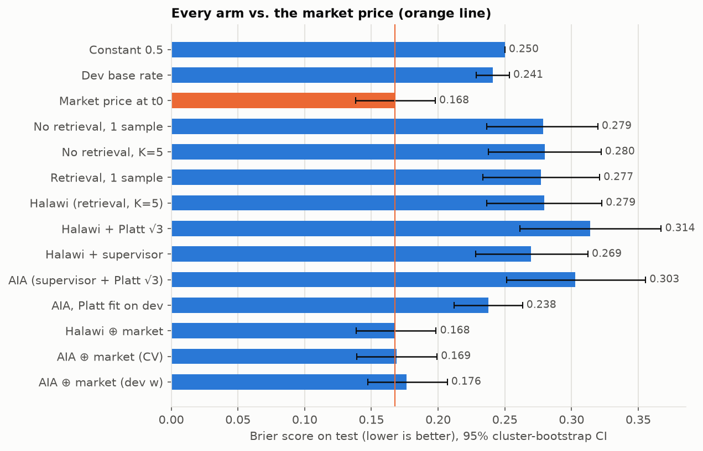
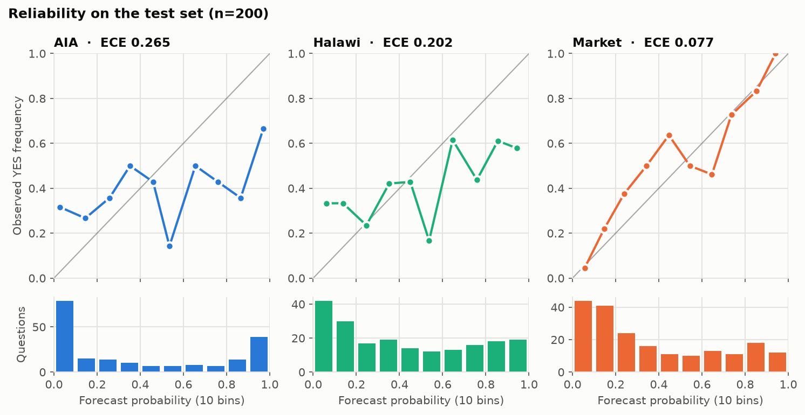
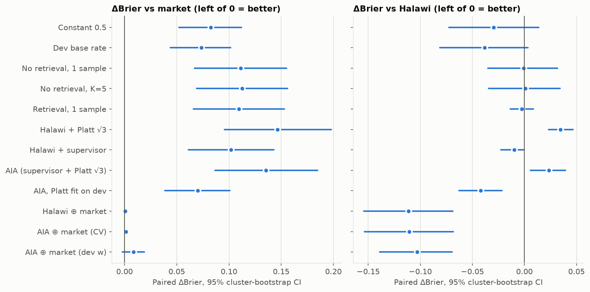
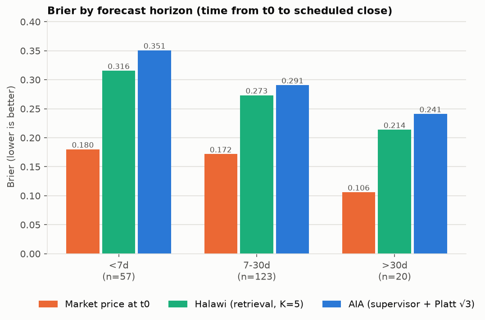
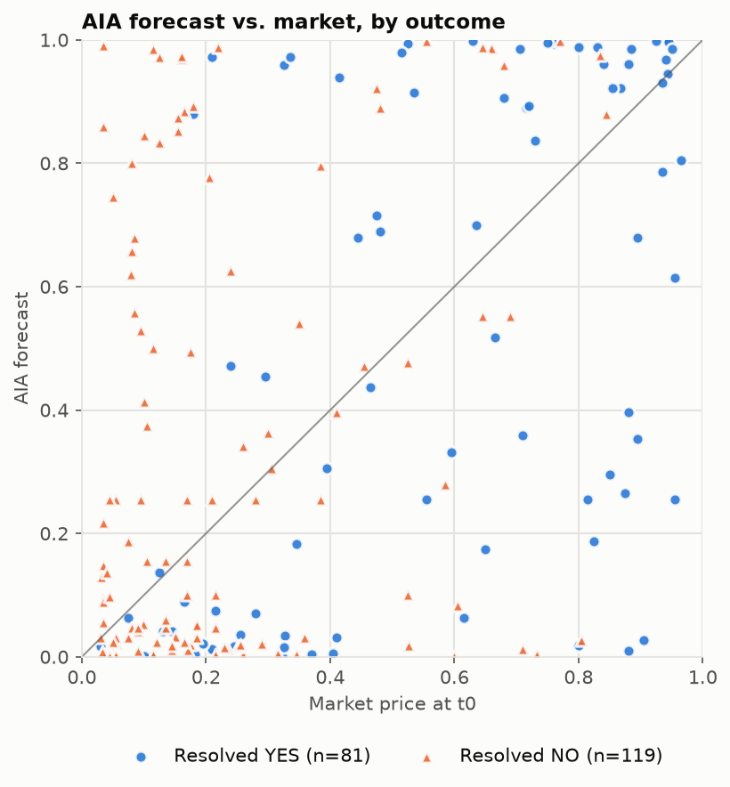

# In Progress: attempt to beat the market

A leak-free backtest of an LLM forecasting agent on 200 binary prediction-market questions, scored against
the **real market price at the same moment**, plus a forward, hash-chained live track record. The agent
reproduces the Halawi et al. (2024) retrieval + scratchpad + ensemble pipeline and adds the three
components of Bridgewater's AIA Forecaster (2025): a supervisor that reconciles disagreeing samples, fixed
√3 extremization, and an LLM ⊕ market blend.

**Result, in one line:** every LLM-only variant scores worse than the market, every uncalibrated one is also
worse than a constant 0.5, the AIA additions made the baseline *worse* overall (extremization hurt; the supervisor alone helped a little),
and the market blend learned to ignore the LLM. All numbers below are generated from
`reports/metrics.json`; nothing is typed by hand.



## Why this is hard

**Markets are efficient.** A liquid prediction-market price aggregates many traders' money and
information. The honest prior for any single model is "won't beat it", so the interesting question is
whether an LLM adds anything *on top of* the market.

**Leakage makes most LLM-forecasting backtests lie.** A model asked in 2026 about an event in 2025 may
simply remember the answer, and a web search "as of" a past date happily returns pages written later.
This project treats leakage as the main engineering problem (next sections).

## What I built

```
Kalshi + Polymarket (free APIs) ──► dataset: 250 questions + 30 canary, price at t0, leak-free window
                                         │
per question:  Haiku query generation ──► Exa news search (published ≤ t0−24h) ──► leakage filters
               ──► Haiku relevance / leak judge / ≤80-word summaries ──► top-6 evidence
               ──► Sonnet 5 × 5 prompt variants (Message Batches, −50%) ──► trimmed mean   = halawi
               ──► supervisor (if samples disagree): names disagreements, 2 new searches, updates = halawi_sup
               ──► sigmoid(√3 · logit p)                                                      = aia
               ──► w·p + (1−w)·p_market, w cross-fitted by event                             = market_ens_aia
evaluation:    Brier, log loss, ECE, Murphy decomposition, paired cluster bootstrap (B=10,000, by event)
live:          open markets ──► same pipeline ──► append-only SHA-256 hash-chained ledger ──► scored on resolution
```

- **Halawi baseline.** The model writes its own search queries; a cheap helper (Claude Haiku 4.5) rates and
  summarizes what comes back; the reasoner (Claude Sonnet 5, thinking disabled, visible scratchpad) answers five
  times with five different reasoning prompts (scratchpad, base rates, outside/inside view, pre-mortem,
  superforecaster checklist); the trimmed mean is the forecast.
- **AIA supervisor.** When the five samples spread by more than 0.10, a supervisor reads the rationales, names the
  disagreements, runs up to two targeted searches, and issues an updated forecast with a confidence level; only a
  "high"-confidence update replaces the mean.
- **Fixed extremization.** Averages of probabilities are typically under-confident, so AIA pushes them out with
  `sigmoid(√3 · logit p)`, a coefficient that is *not* fitted (Neyman & Roughgarden, 2022).
- **Market blend.** `w · p_llm + (1 − w) · p_market`, with `w` chosen by 5-fold cross-fitting grouped by event
  (and separately by fitting on the dev split).

## Leakage

| Layer | Control |
|---|---|
| Model memory | Questions created after Sonnet 5's training cutoff (Jan 2026): created ≥ 2026-02-01, scheduled to close ≤ 2026-09-30. A 30-question **canary** set resolved in 2025 detects memorization. |
| Retrieval | Exa `endPublishedDate = t0 − 24h`; **undated results dropped** (in testing they were mostly post-cutoff odds pages); "Updated <date>" marker scan; blocklist of prediction markets, odds aggregators, Wikipedia and social media; a helper-model judge for "describes events after t0" / "reveals the outcome". |
| Question text | Kalshi's `expiration_value` holds the realized outcome ("Hike 25bps"), `rules_secondary` can be amended, and Polymarket descriptions accrue "Update:" paragraphs. Only whitelisted fields reach a prompt (`schemas.prompt_fields`), and a test asserts the outcome text never appears. |
| Selection | Markets are filtered on their *scheduled* close (Kalshi `expected_expiration_time`, which an early close does not move), not the actual close, so "will X happen by…" questions that resolved YES early are not over-represented. The YES rate of the dropped early-closers is reported. |
| Human check | 50 random kept evidence items audited by hand against t0. |

<!-- LEAKAGE:START -->
| Check | Value |
|---|---|
| Canary (pre-cutoff, n=30): no-retrieval K=5 Brier | 0.1629 (market 0.1901) |
| Test (post-cutoff, n=200): no-retrieval K=5 Brier | 0.2802 (market 0.1676) |
| Kept evidence per test question (mean) | 3.45 |
| Evidence dropped on test questions, by filter | haiku_leak_flag=214, kept=690, low_relevance=510, null_date=1914, over_max_articles=429, over_max_evidence=106, text_post_t0_date=5 |
| Robustness: AIA Brier excluding questions whose retrieval surfaced any helper-flagged item | 0.2880 on n=108 (all questions 0.3029; market on the same subset 0.1703) |
| Human audit of 50 random kept items | leak 0.0%, leak-or-unsure 2.0% (verdicts {'clean': 49, 'unsure': 1}) |
<!-- LEAKAGE:END -->

The canary does what it should: on pre-cutoff questions the no-retrieval model beats the market (it likely
remembers), while on the post-cutoff test set it is far worse than the market.

## Results

<!-- METRICS:START -->
_Auto-generated from `reports/metrics.json` by `mf report`. Test set: 200 questions (126 events) scored of 200; test YES rate 0.405; paired cluster bootstrap B=10000 by event._

| Arm | Brier | 95% CI | Log loss | ECE | BSS vs market |
|---|---|---|---|---|---|
| Constant 0.5 (`const_0.5`) | 0.2500 | [0.2500, 0.2500] | 0.6931 | 0.0950 | -0.4919 |
| Dev base rate (`base_rate`) | 0.2410 | [0.2287, 0.2533] | 0.6750 | 0.0050 | -0.4382 |
| Market price at t0 (`market`) | 0.1676 | [0.1382, 0.1978] | 0.4993 | 0.0766 | +0.0000 |
| No retrieval, 1 sample (`noret_single`) | 0.2787 | [0.2366, 0.3197] | 0.8563 | 0.1911 | -0.6629 |
| No retrieval, K=5 (`noret_ens`) | 0.2802 | [0.2378, 0.3221] | 0.8533 | 0.2167 | -0.6720 |
| Retrieval, 1 sample (`halawi_single`) | 0.2769 | [0.2337, 0.3210] | 0.8464 | 0.2093 | -0.6526 |
| Halawi (retrieval, K=5) (`halawi`) | 0.2794 | [0.2364, 0.3227] | 0.8493 | 0.2020 | -0.6673 |
| Halawi + Platt √3 (`halawi_platt`) | 0.3140 | [0.2612, 0.3671] | 1.1241 | 0.2764 | -0.8739 |
| Halawi + supervisor (`halawi_sup`) | 0.2695 | [0.2280, 0.3122] | 0.8203 | 0.1926 | -0.6081 |
| AIA (supervisor + Platt √3) (`aia`) | 0.3029 | [0.2515, 0.3554] | 1.0808 | 0.2651 | -0.8076 |
| AIA, Platt fit on dev (`aia_platt_fit`) | 0.2375 | [0.2121, 0.2632] | 0.6728 | 0.0888 | -0.4174 |
| Halawi ⊕ market (`market_ens_halawi`) | 0.1682 | [0.1387, 0.1985] | 0.5019 | 0.0706 | -0.0038 |
| AIA ⊕ market (CV) (`market_ens_aia`) | 0.1688 | [0.1392, 0.1991] | 0.5045 | 0.0687 | -0.0074 |
| AIA ⊕ market (dev w) (`market_ens_aia_devw`) | 0.1763 | [0.1472, 0.2069] | 0.5346 | 0.0624 | -0.0519 |

**Pre-registered primary comparisons** (paired ΔBrier, negative = first arm better):

- `aia_minus_halawi`: +0.0235 (95% CI [+0.0058, +0.0394]; P(Δ<0) = 0.005)
- `market_ens_aia_minus_market`: +0.0012 (95% CI [+0.0004, +0.0021]; P(Δ<0) = 0.003)

**Leak canary** (no retrieval, K=5): canary Brier 0.1629 (n=30, market 0.1901) vs test Brier 0.2802 (market 0.1676).
<!-- METRICS:END -->









## What didn't work

<!-- FAILURES:START -->
| Arm | Brier | ΔBrier vs market [95% CI] | Brier − 0.25 (const 0.5) | ECE |
|---|---|---|---|---|
| Dev base rate | 0.2410 | +0.0734 [+0.0439, +0.1016] | -0.0090 | 0.0050 |
| No retrieval, 1 sample | 0.2787 | +0.1111 [+0.0669, +0.1550] | +0.0287 | 0.1911 |
| No retrieval, K=5 | 0.2802 | +0.1126 [+0.0691, +0.1561] | +0.0302 | 0.2167 |
| Retrieval, 1 sample | 0.2769 | +0.1094 [+0.0660, +0.1531] | +0.0269 | 0.2093 |
| Halawi (retrieval, K=5) | 0.2794 | +0.1118 [+0.0692, +0.1552] | +0.0294 | 0.2020 |
| Halawi + Platt √3 | 0.3140 | +0.1464 [+0.0956, +0.1981] | +0.0640 | 0.2764 |
| Halawi + supervisor | 0.2695 | +0.1019 [+0.0611, +0.1430] | +0.0195 | 0.1926 |
| AIA (supervisor + Platt √3) | 0.3029 | +0.1353 [+0.0868, +0.1848] | +0.0529 | 0.2651 |
| AIA, Platt fit on dev | 0.2375 | +0.0700 [+0.0387, +0.1008] | -0.0125 | 0.0888 |
| Halawi ⊕ market | 0.1682 | +0.0006 [+0.0001, +0.0012] | -0.0818 | 0.0706 |
| AIA ⊕ market (CV) | 0.1688 | +0.0012 [+0.0004, +0.0021] | -0.0812 | 0.0687 |
| AIA ⊕ market (dev w) | 0.1763 | +0.0087 [-0.0023, +0.0189] | -0.0737 | 0.0624 |

Supervisor triggered vs not (Brier):

- not_triggered (n=106): market 0.1918, halawi 0.2872, aia 0.3233
- triggered (n=94): market 0.1402, halawi 0.2706, aia 0.2799

Platt coefficient fit on dev: 0.462 (AIA's fixed value is √3 ≈ 1.732). Market-blend weight on AIA: dev-fit 0.25; cross-fitted folds [0.0, 0.03, 0.03, 0.0, 0.05].
<!-- FAILURES:END -->

- **Overconfidence is the core failure.** The model is somewhat informative (positively correlated with
  outcomes) but puts many questions near 0 or 1 that resolve the other way.
- **Extremization assumes the opposite problem.** AIA's √3 fixes *under*-confident averages; this ensemble was
  *over*-confident, so the coefficient fitted on dev is below 1 (shrink toward 0.5), and the fixed √3 hurt badly.
- **The supervisor was the one AIA component that helped**, modestly, and rarely felt confident enough to
  override the mean.
- **Retrieval added nothing measurable.** Evidence was thin after dropping undated pages, and many questions are
  short-horizon data releases or price thresholds where the market already prices the data.
- **No pre-registered subset** (venue, category, horizon, supervisor-triggered) has the LLM beating the market.

Plausible causes, not proven here: the model's world knowledge stops in January 2026, before the 2026 Iran war and
its effects on oil, shipping and inflation; prompts that encourage crisp "status quo" calls at short horizons;
and N = 200 (minimum detectable effect ≈ 0.012 Brier). Details in [RESULTS.md](RESULTS.md).

## Live track record

`mf live` forecasts open markets (both venues, closing in 7–60 days) with the full pipeline and appends each
forecast to `data/live/forecasts.jsonl`. Each record stores the market price fetched in the same minute and
`hash = sha256(record + previous hash)`, so editing or deleting any past record breaks every later link.
Committing the file after each run adds an external timestamp, so forecasts can't be backfilled.

```bash
uv run mf verify-ledger      # LEDGER OK n=<count> head=<hash>
uv run mf score-live         # score forecasts whose markets have resolved
```

The cumulative live chart appears in `reports/index.html` once forecasts resolve.

## Cost 

Every external call goes through a content-addressed cache (`sha256` of the canonical request, including the
prompt file's hash), so re-runs cost $0 and editing one prompt invalidates only its calls. A budget guard reserves
a pessimistic estimate *before* every paid call (including the worst case of a whole Message Batch) and refuses
anything that would cross the Anthropic total, the Anthropic backtest, the Exa monthly, or the per-run cap. A
10-question pilot measured real $/question before the main run was allowed.

<!-- COST:START -->
- Anthropic total: $14.56 of $30.00 cap (backtest $13.96 of $23.00).
- Exa 2026-10: $3.29 of $9.00 monthly cap.
- Paid API calls (cache misses): 4244.

| Provider | Op | Month | Calls | USD |
|---|---|---|---|---|
| anthropic | query_gen | 2026-10 | 260 | 0.1449 |
| anthropic | reason | 2026-10 | 135 | 0.9905 |
| anthropic | reason_batch | 2026-10 | 1200 | 4.5677 |
| anthropic | reason_noret | 2026-10 | 50 | 0.3213 |
| anthropic | reason_noret_batch | 2026-10 | 1150 | 4.0529 |
| anthropic | relevance_summary | 2026-10 | 377 | 2.7379 |
| anthropic | smoke_batch_batch | 2026-10 | 1 | 0.0000 |
| anthropic | smoke_helper | 2026-10 | 1 | 0.0001 |
| anthropic | smoke_reasoner | 2026-10 | 1 | 0.0009 |
| anthropic | supervisor_disagree | 2026-10 | 131 | 1.2516 |
| anthropic | supervisor_update | 2026-10 | 131 | 0.4952 |
| exa | search_fast | 2026-10 | 19 | 0.1330 |
| exa | search_instant | 2026-10 | 788 | 3.1520 |
<!-- COST:END -->

## Reproduce

```bash
uv sync
uv run pytest -q                       # offline, $0 (readonly cache; FakeLLM; recorded fixtures)
uv run python -m mf.data.dataset --validate
uv run mf evaluate                     # recomputes reports/metrics.json from committed run files, $0
uv run mf report                       # figures, reports/index.html, README/RESULTS blocks
uv run python scripts/verify.py        # the full gate; ends with VERIFY: PASS metrics_sha=...
```

Re-running the *paid* steps (`mf retrieve`, `mf forecast`, `mf live`) needs `ANTHROPIC_API_KEY` and `EXA_API_KEY`
in `.env` (see `.env.example`), because the raw-response cache is not committed (it contains third-party article
text). The committed run files (`data/runs/backtest_v1/*.jsonl`: evidence summaries, every sample's rationale and
probability, every arm's forecast) are enough to re-evaluate everything for $0. On Windows PowerShell set the cache
mode with `$env:MF_CACHE_MODE="readonly"`.

## Limitations

- **Small N.** 200 test questions in 126 events; effects smaller than ~0.01 Brier are not detectable.
- **One model family.** All five "ensemble members" are the same model with different prompts; their errors are
  strongly correlated, which limits what ensembling and the supervisor can do.
- **Question mix.** The filters admit count- and threshold-style markets (social-media post counts, GPU rental
  prices; in live mode also Rotten Tomatoes scores) alongside geopolitical and economic questions. Kalshi's "Mentions" category is excluded,
  but similar markets enter through other categories on both venues.
- **Polymarket volume floor.** Gamma's pagination limit raised the effective volume floor to about $90–120k in busy
  weeks (documented in RESULTS.md), tilting the Polymarket half toward more liquid markets.
- **Retrieval leakage can be reduced, not proven absent.** Exa's index may reflect later page versions; the audit
  found one stale publish date (content still pre-t0).
- **Market price at t0** is a mid when the spread is ≤ 10¢, otherwise the last trade, which can be stale.
- **No trading.** Brier gains, had there been any, would not imply profit after fees, spread and adverse selection.

Future work: shrink-toward-market calibration fit on a larger dev split; retrieval that prefers primary data sources
(statistics releases, official calendars) for data-release questions; a newer reasoner on a live-only arm; and the
stretch goals in PLAN.md (N = 400, Beta-Bernoulli calibrator, toy trading backtest).

## References

Halawi et al. 2024 (arXiv 2402.18563); AIA Forecaster technical report (arXiv 2511.07678); Neyman & Roughgarden
2022 (arXiv 2111.03153); Paleka et al., *Pitfalls in Evaluating Language Model Forecasters* (arXiv 2506.00723).
Full list with notes in [RESOURCES.md](RESOURCES.md); concepts and interview-style Q&A in [LEARNING.md](LEARNING.md).
